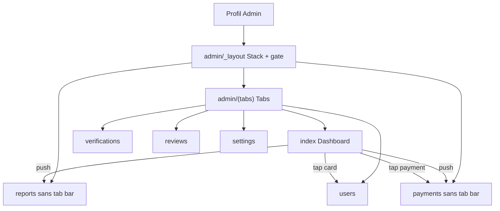

# Admin : bottom navbar + cards/sheets enrichis

## Périmètre

### Onglets (avec bottom navbar)

| Tab | Route | Contenu |
|-----|-------|---------|
| Tableau de bord | `admin/(tabs)/index` | Stats actuelles + liens vers pages hors-tabs + pending users (max 5) + paiements réussis récents (max 10) |
| Utilisateurs | `admin/(tabs)/users` | Liste + filtre type en bottomsheet + detail sheets |
| Vérifications | `admin/(tabs)/verifications` | Liste + detail sheets |
| Modération Avis | `admin/(tabs)/reviews` | Liste + detail sheets |
| Paramètres | `admin/(tabs)/settings` | Settings plateforme |

### Hors bottom navbar (accès depuis le dashboard uniquement)

- [`reports`](src/app/admin/reports.tsx) — Signalements
- [`payments`](src/app/admin/payments.tsx) — Paiements (liste complète)

Ces écrans restent des options / cartes de navigation sur le **Tableau de bord** et s’ouvrent en **Stack push** sans tab bar.

## Architecture navigation



Restructuration Expo Router (inspirée de [`src/app/(tabs)/_layout.tsx`](src/app/(tabs)/_layout.tsx)) :

```
src/app/admin/
  _layout.tsx              # Auth gate + Stack (tabs group + reports + payments)
  (tabs)/
    _layout.tsx            # Tabs : 5 écrans, tab bar custom
    index.tsx              # Dashboard
    users.tsx
    verifications.tsx
    reviews.tsx
    settings.tsx
  reports.tsx              # Stack only — pas de tab bar
  payments.tsx             # Stack only — pas de tab bar
```

- Déplacer les 5 écrans tab dans `(tabs)/` ; garder `reports` / `payments` au niveau Stack.
- Mettre à jour les `router.push` (Profil → `/admin` ou `/admin/(tabs)`, liens internes).
- Tab bar : **pas de bleu/cyan** — actif = `colors.primary` (noir jour / blanc nuit), inactif = `colors.muted`, wash focus = `colors.iconWash` ou `primary + alpha` léger (pas `orbit`).
- Badges tab optionnels : pending providers / pending verifications / pending reviews si données déjà dispo.

## Contenu ne dépasse jamais dans la system bottom navbar

Double protection, calquée sur les tabs principales :

1. **Tab bar elle-même** : `height = TAB_CONTENT_HEIGHT + paddingBottom` avec `paddingBottom = max(insets.bottom, …)` ; fond `colors.canvas` full-bleed sous la zone système (comme le commentaire dans `(tabs)/_layout`).
2. **Contenu scrollable des tabs** : `PageScaffold` avec `bottomInset={false}` + `contentContainerStyle.paddingBottom` ≥ hauteur tab bar (+ marge), pour que listes/cards ne passent **jamais sous** la tab bar ni sous la barre système.
3. **Écrans hors-tabs** (`reports`, `payments`) : `PageScaffold` `bottomInset={true}` (safe-area système uniquement) — pas de tab bar.
4. **Detail sheets** : footer sticky avec `insets.bottom` (prop `footer` sur `AppBottomSheet`) — actions au-dessus de la barre système.

Constante partagée ex. `ADMIN_TAB_BAR_HEIGHT` / helper `useAdminTabBarPadding()` pour éviter les magic numbers dispersés.

## Tableau de bord enrichi

Sur [`index`](src/app/admin/index.tsx) (après move) :

1. **Bloc stats / CA** existant (accents `primary`, pas orbit).
2. **Navigation hors-tabs** : cards/rows « Signalements » + « Paiements » (pages absentes du bottom nav), avec badges pending/open si dispo — **plus** de rows vers Users / Vérifs / Avis / Settings (déjà dans la tab bar).
3. **Utilisateurs en attente** : max **5** cards enrichies (`status === 'pending'`, idéalement providers) — tap → sheet détail ou navigation vers Users ; CTA « Voir tout » → tab Users filtré pending.
4. **Paiements réussis récents** : max **10** (`status === 'released'`), cards enrichies — tap → sheet détail ou push `/admin/payments`.

Backend : réutiliser / étendre [`convex/admin.ts`](convex/admin.ts) (`listUsers`, `listPayments`, ou query dashboard dédiée `pendingUsers` + `recentReleasedPayments` avec limits) pour éviter de tout `.collect()` côté client.

## Utilisateurs — filtre par type en bottomsheet

- Remplacer ou compléter les chips status : ouvrir un **bottomsheet filtre** (type = rôle : `all` | `client` | `provider` | `admin`) via bouton filtre dans le header.
- Brancher l’arg `role` déjà supporté par `api.admin.listUsers`.
- Conserver le filtre status (chips ou même sheet multi-section) sans casser l’UX actuelle.
- Tones sheet filtre : Appliquer `ink` + Réinitialiser/Fermer `outline` (uniques).

## Cards + detail sheets (inchangé dans l’intention, élargi)

Cards enrichies (`AdminListCard`) + detail sheets + actions sticky pour :

| Écran | Tab bar ? | Detail sheet + actions |
|-------|-----------|------------------------|
| Users | oui | oui — mapping tones |
| Verifications | oui | oui |
| Reviews | oui | oui |
| Reports | non | oui |
| Payments | non | lecture seule |
| Settings | oui | sheet édition existant, CTA `ink` |
| Dashboard | oui | cards pending/payments → sheets ou navigation |

### Pattern `AdminListCard` + detail

Voir sections précédentes : leading media, badges humanisés, meta, chevron ; actions uniquement dans footer sticky sheet ; formulaires en mode `detail` → `form` dans le même sheet.

### Politique couleur

- Primaire admin = noir (jour) / blanc (nuit) via `colors.primary` / `tone="ink"`.
- Interdit `orbit` / cyan / bleu comme accent ou CTA dans ce scope.
- Sur un même footer sheet : tones **uniques** (`ink` / `outline` / `danger`), max 3.

### Mapping footer actions

| Contexte | A | B |
|----------|---|---|
| Users pending | Approve `ink` | Reject `danger` |
| Users active | Suspend `danger` | Premium on `ink` / off `outline` |
| Users suspended/rejected | Reactivate `ink` | — |
| Verifications pending | Approve `ink` | Reject `danger` |
| Reports open | Resolve `ink` | Dismiss `outline` |
| Reviews pending | Approve `ink` | Hide `danger` |
| Form | Confirm `ink`\|`danger` | Cancel `outline` |
| Filter sheet | Apply `ink` | Reset/Close `outline` |

## Primitives partagées

1. **`AppBottomSheet` `footer`** — sticky + safe-area.
2. **`src/components/admin/adminUi.tsx`** — `AdminListCard`, detail rows, status/role parsers, padding tab helper.
3. **`src/app/admin/(tabs)/_layout.tsx`** — tab bar admin.
4. **i18n** — labels tabs, badges singuliers, filtre type, sections dashboard (`pendingUsers`, `recentPayments`, etc.).

## Fichiers principaux touchés

- [`src/app/admin/_layout.tsx`](src/app/admin/_layout.tsx) — Stack parent
- Nouveau `src/app/admin/(tabs)/_layout.tsx` + move des 5 écrans
- [`src/app/admin/index.tsx`](src/app/admin/index.tsx) → dashboard enrichi
- [`src/app/admin/users.tsx`](src/app/admin/users.tsx) — filtre type sheet
- reports / payments / verifications / reviews / settings
- [`convex/admin.ts`](convex/admin.ts) — queries limitées dashboard si besoin
- [`AppBottomSheet.tsx`](src/components/ui/AppBottomSheet.tsx)
- `src/components/admin/adminUi.tsx`
- locales `fr` / `ar` / `sara`
- liens Profil [`profile.tsx`](src/app/(tabs)/profile.tsx) si chemin « Administration » à ajuster
