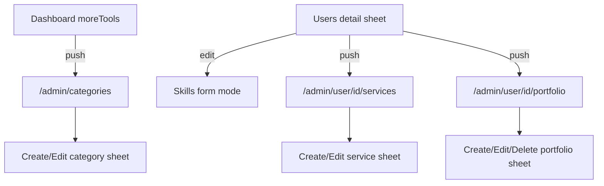

# Admin : profil utilisateur + catégories

## Périmètre

Toujours dans le scope superadmin existant (`role === 'admin'`).

1. **Par utilisateur** (depuis Users) : gérer **services**, **portfolio**, **compétences**.
2. **Plateforme** (depuis Tableau de bord) : **gestion des catégories** (ajout / modification / désactivation).

Hors scope : catalogue table `skills` séparée, hard-delete catégories, bio/ville/avatar (déjà visibles en lecture).

## Architecture

- Tabs inchangés (Dashboard, Users, Vérifs, Avis, Settings).
- Nouvelles routes **stack** (sans bottom navbar), comme reports/payments :
  - [`src/app/admin/categories.tsx`](src/app/admin/categories.tsx)
  - [`src/app/admin/user/[userId]/services.tsx`](src/app/admin/user/[userId]/services.tsx)
  - [`src/app/admin/user/[userId]/portfolio.tsx`](src/app/admin/user/[userId]/portfolio.tsx)
- Enregistrer dans [`src/app/admin/_layout.tsx`](src/app/admin/_layout.tsx).
- UI : `AdminListCard`, detail sheets, footer sticky, primaire `ink` / noir-blanc, actions uniques (`ink` / `outline` / `danger`), pas d’`orbit`.

## Backend

### Catégories — déjà prêt

Réutiliser [`convex/categories.ts`](convex/categories.ts) :
- `list({ activeOnly: false })` pour l’admin
- `create` / `update` / `remove` (soft `isActive: false`) déjà `requireAdmin`

Aucun nouveau endpoint catégories.

### Profil utilisateur — nouveaux endpoints admin

Dans [`convex/admin.ts`](convex/admin.ts) (ou module voisin `convex/adminContent.ts` importé côté admin) :

| API | Rôle |
|-----|------|
| `updateUserSkills({ userId, skills })` | Patch `profiles.skills` du profil lié |
| `listUserServices({ userId })` | Tous les services du provider (actifs + inactifs) |
| `upsertUserService(...)` | Create/update service pour `userId` (champs essentiels : title, description, categoryId, price, isActive) |
| `deactivateUserService({ serviceId })` | Soft off (`isActive: false`) |
| `listUserPortfolio({ userId })` | Items portfolio du profil + URLs images |
| `upsertUserPortfolioItem(...)` | Create/update (title, description, imageStorageId, sortOrder) |
| `removeUserPortfolioItem({ portfolioId })` | Delete item |

Toutes les mutations : `requireAdmin` puis résolution `profile` via `by_user`. Ne pas élargir les mutations provider existantes (évite effets de bord).

Réutiliser upload fichiers existant (`convex/files` / pattern portfolio provider) pour les images portfolio admin.

## UI

### 1. Dashboard — option Catégories

Dans [`src/app/admin/(tabs)/index.tsx`](src/app/admin/(tabs)/index.tsx), section `moreTools` : ajouter une row **Catégories** (icône `SquaresFour` / similaire, `colors.primary`) → `/admin/categories`, à côté de Litiges et Paiements.

### 2. Page Catégories

[`src/app/admin/categories.tsx`](src/app/admin/categories.tsx) :
- `PageScaffold` + `showBack` + `bottomInset` système (pas de tab bar)
- Liste `AdminListCard` : nom FR, slug, badge actif/inactif, `sortOrder`, count services si dispo via `listWithCounts`
- Tap → sheet détail / édition
- FAB ou bouton header « Ajouter » → sheet création
- Formulaire : `nameFr`, `nameAr`, `nameSara`, `slug` (create only), `icon`, `description`, `sortOrder`, toggle `isActive`
- Footer : Enregistrer `ink` ; Désactiver `danger` (si actif) ; Annuler `outline` en mode form — tones uniques

### 3. Users — sheet détail enrichi

Dans [`src/app/admin/(tabs)/users.tsx`](src/app/admin/(tabs)/users.tsx), si profil présent :

- Section **Compétences** : chips + bouton Modifier → mode form dans le même sheet (input + tags, footer Appliquer `ink` / Annuler `outline`)
- Rows navigation (Pressable) :
  - **Services proposés** → `/admin/user/[userId]/services` (disabled / hint si pas provider ou pas de profil)
  - **Portfolio** → `/admin/user/[userId]/portfolio`

Actions compte existantes (approve/suspend/premium) inchangées.

### 4. Services d’un user

Page stack :
- Liste cards : titre, prix, catégorie, badge actif/inactif
- Tap → sheet edit ; « Ajouter » → sheet create
- Champs alignés sur le formulaire provider (sous-ensemble) : title, description, categoryId (`CategoryPickerSheet` existant), price, isActive
- Footer : Save `ink` ; Désactiver `danger` ; Cancel `outline`

### 5. Portfolio d’un user

Page stack :
- Grille / liste d’items (image + titre)
- Tap → sheet edit / delete
- Ajouter : pick image + title/description
- Footer : Save `ink` ; Supprimer `danger` ; Cancel `outline`

## Cohérence avec l’admin actuel

- Pas de tab bar sur ces pages stack
- Contenu ne dépasse pas dans la system navbar (`bottomInset` / padding)
- i18n : clés `admin.categories*`, `admin.userServices*`, `admin.userPortfolio*`, `admin.skills*` dans fr / ar / sara

## Fichiers principaux

- [`convex/admin.ts`](convex/admin.ts) — nouvelles queries/mutations
- [`src/app/admin/_layout.tsx`](src/app/admin/_layout.tsx) — screens stack
- [`src/app/admin/(tabs)/index.tsx`](src/app/admin/(tabs)/index.tsx) — lien Catégories
- [`src/app/admin/(tabs)/users.tsx`](src/app/admin/(tabs)/users.tsx) — skills + liens
- Nouveaux : `categories.tsx`, `user/[userId]/services.tsx`, `user/[userId]/portfolio.tsx`
- [`src/components/admin/adminUi.tsx`](src/components/admin/adminUi.tsx) — helpers si besoin
- Locales fr / ar / sara
